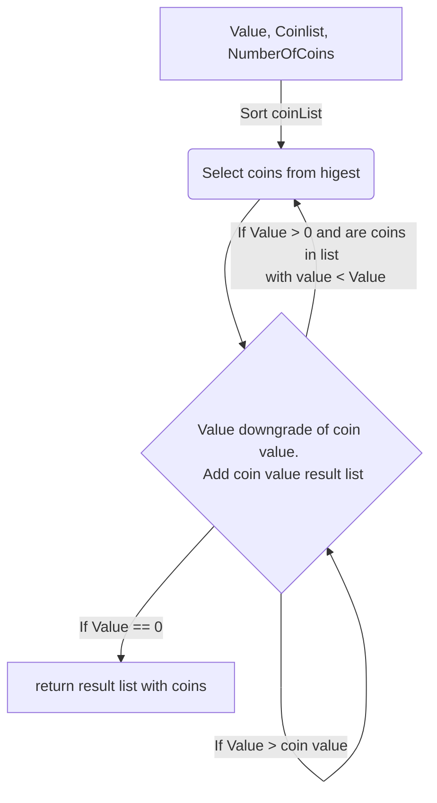

# Minimalna liczba monet, które tworzą daną wartość

## Praca wykonal [Vladimir Poplavskij](https://github.com/wirtaw/)

## Projekt do przedmiotu "Algorytmy i struktury danych"

## Data 2023-01-20

- [Zadanie](#zadanie)
- [Chciwy algorytm](#chciwy-algorytm)
- [Algorytm śledzenia wstecznego](#algorytm-sledzenia-wstecznego)

## Zadanie 

Ilość monet nielimitowana.

Najpierw zdefiniujemy problem wprowadzania zmian na przykładzie wziętym z życia. Następnie zrozumiemy podstawową ideę podejścia do rozwiązania problemu wprowadzania zmian i zilustrujemy jego działanie, rozwiązując nasz przykładowy problem.

---
### Przykład

Podana jest lista monet `C(c1, c2, ……Cn)` i podana jest również wartość sumy V. Teraz problem polega na tym, aby użyć minimalnej liczby monet, aby otrzymać suma `V`.

Uwaga: Załóżmy, że istnieje nieskończona liczba monet `C`.

W tym zadaniu rozważymy zestaw różnych monet `C{1, 2, 5}`. Istnieje nieskończona liczba monet każdego rodzaju. Aby zmienić żądaną wartość, postaramy się pobrać minimalną liczbę monet dowolnego typu. Przykładowo dla wartości `22`: jako minimum wybierzemy `{5, 5, 5, 5, 2}`, 5 monet.

## Chciwy algorytm

### Pseudokod

`minCoins(coinList, n, value)`

Wejście: lista różnych monet, liczba monet, podana wartość.

Dane wyjściowe: Minimalna liczba monet, aby uzyskać daną wartość.

### Diagram blokowy


$$ f \in d $$
```math
\sqrt{3}
```
### Program

```c
function minCoins (coinList, n, value) {
  S[MAX_INT];
  C = sort(coinList);
  j=0;
  for (i = n - 1; i > 0; i--) {
        while (value >= C[i]) {
	        S[j] = C[i];
	        value = value - C[i];
            j++;	
        }
    if (n == 0) {
	    break;
    }
  }
  retrurn S;
}

```

### Zlozoność czasowa

Możemy posortować tablicę C nominałów monet w czasie `O(n ㏒₂ n)`. Podobnie pętla for zajmuje `O(n)` czasu, ponieważ w najgorszym przypadku możemy potrzebować n monet, aby dokonać zmiany.

Stąd ogólna złożoność czasowa algorytmu chciwego staje się `O(n)` od `n` ⋘ value. Chociaż możemy wdrożyć to podejście w efektywny sposób z czasem `O(n ㏒₂ n)`.


### Poprwaność

Algorytm chciwy do znalezienia minimalnej liczby monet dla danej wartości jest poprawny. Dzieje się tak, ponieważ wykorzystuje strategię polegającą na wybieraniu zawsze największej monety, której można użyć, aby zminimalizować całkowitą liczbę potrzebnych monet. W ten sposób zapewnia się, że później nie będzie trzeba wybierać większej monety, co zwiększyłoby całkowitą liczbę wymaganych monet.


### Program

[greedyMinCoins.c](./greedyMinCoins.c)

--- 
Ograniczeniem algorytmu chciwego jest to, że może on nie zapewniać optymalnego rozwiązania dla niektórych wyznań.

Na przykład powyższy algorytm nie uzyskuje optymalnego rozwiązania dla `C= {1,6,10}` i `value=13`. W szczególności zapewniłoby to rozwiązanie z czterema monetami, tj. `S = {10,1,1,1}`.

Jednak optymalnym rozwiązaniem tego problemu są trzy monety, czyli `S = {6,6,1}`.


## Algorytm śledzenia wstecznego

### Wstep

Efektwne znaliezenie minimalnej liczby monet od podanej sumy. Wymaga najpierw znalisc minimalna ilosc monet. 
Zatem, jezeli taka ilosc isnieje to wybieramy wsrod wszykich mozliwych monet przez odejmownia wartosci.

### Pseudokod

```c
function minCoins(coinList, n, value, dp) {
  if (dp[value] != -1) return dp[value];
  
  coinsRequired = INT_MAX;	
  for (i = 0; i < n; i++) {
    if (coinList[i] <= value) {
        subRes = minCoins(coinList, n, value - coinList[i], dp);
        if (subRes != INT_MAX && subRes + 1 < coinsRequired) {
            coinsRequired = subRes + 1;
        }
    }

  }
  dp[value] = coinsRequired;
	
  return coinsRequired;
}

function coinChange(coinList, n, value, dp) {
  coinsRequired = minCoins(coinList, n, value, dp);
  
  if(coinsRequired == INT_MAX) {
	return -1;
  }	
  return coinsRequired;
}
```

### Zlozoność czasowa

Złożoność czasowa: `O(N*X)`, gdzie N to długość danej tablicy, a `X` to podana liczba całkowita.
Przestrzeń pomocnicza: `O(N)`


### Poprwaność

Algorytm śledzenia wstecznego używany do znalezienia minimalnej liczby monet o danej wartości zaczyna od monety o najwyższym nominale, a następnie wywołuje się rekurencyjnie, zmniejszając pozostałą kwotę, aż osiągnie 0. Jeśli w dowolnym momencie nie ma możliwości aby uzupełnić pozostałą kwotę za pomocą dostępnych monet, następnie wycofujemy się i próbujemy ponownie z niższymi nominałami.

Aby udowodnić, że ten algorytm znajduje prawidłowe rozwiązanie, musimy pokazać, że każdy wykonany krok jest prawidłowy (tj. nie prowadzi nas nieprawidłową ścieżką). Ponieważ każdy krok zmniejsza kwotę pozostałą do uzupełnienia poprzez dodanie większej liczby monet lub zmianę nominałów, wynika z tego, że jeśli wszystkie kroki są prawidłowe, ostatecznie osiągniemy stan, w którym nasza suma

### Program

[backtrackingMinCoins.c](./backtrackingMinCoins.c)

## Literatura

 - "Algorithms Notes for Professionals", [goalkicker.com](https://goalkicker.com/AlgorithmsBook) ."Change-making problem" 
 - "Data Structures and Algorithm Analysis", Clifford A. Shaffer, 2011
 - "The Algorithm Design Manual", Steven S. Skiena, 2020


## Zrodla

- [Coin Change Problem](https://www.scaler.com/topics/coin-change-problem/)
- [Greedy Algorithm to Find Minimum Number of Coins](https://www.baeldung.com/cs/min-number-of-coins-algorithm)
- [Find minimum number of coins that make a given value](https://www.geeksforgeeks.org/find-minimum-number-of-coins-that-make-a-change/)
